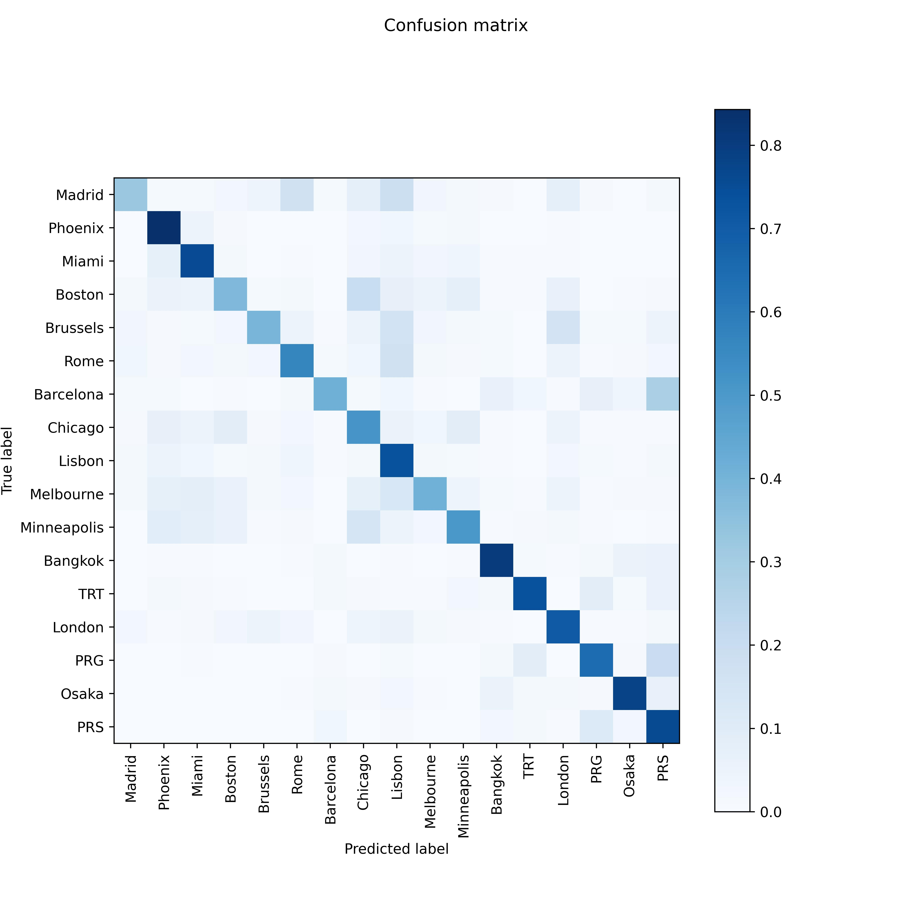

## Project description

## Overview
In the game [GeuGuessr](https://www.geoguessr.com) you get placed in a random Google streetview location, and through moving around and looking around you can make a guess as to where you were spawned. The main goal of this project was to develop a model that can guess the location where a photo was taken in. There are various professional GeoGuessr players who can identify their approximate location astoundingly fast by identifying distinguishing features such as license plates, street signs or other more or less specific features.

The aim of this project was to see whether one can leverage the active recognition of certain features in order to improve the quality of a guess.

## Methodology

In order to obtain good results for a random location throughout the whole world, it is necessary to employ very large datasets and deep models. Due to computational restrictions we decided to instead use the reasonably sized (around 500.000 pictures) dataset from this [Kaggle dataset](https://www.kaggle.com/datasets/amaralibey/gsv-cities), which includes pictures from 23 different cities. After cleaning the dataset and removing heavily over- and underrepresented cities we ended up with a dataset comprised of about 350.000 pictures from 17 different cities. We then performed an 80-20 split into a training and a test set, stratified on the cities. The cleaned and split up test set is available [here](https://www.kaggle.com/datasets/bezemekz/gsv-cities-cleaned-normalized-train-test). We left the test set completely untouched until we made our model choices and had trained the model.

### The end-to-end model
This model does not obtain any additional feature input except for the pictures and their label. The architecture of this model is comprised of the MobilenetV2 network, which is a relatively lightweight network taht comes pretrained and is designed for image recognition tasks. We then added three Dense layers of 256, 256 and 17 neurons each at the end, separated by 20% dropout layers. We only trained the weights on the additional layers and left the previous model unchanged. This performed much better than initial attempts of creating our own CNN and also training was much faster. We also quickly realised that due to the size of the dataset, hyperparameter optimisation takes a long time. The final model was trained over 4 epochs, and the training took around 5 hours on Kaggle (using an Nvidia P100 GPU).

### The feature based classifiers
First, using an already exising model, namely the COCO (common objects in context) classifier, we inspected images from the training set for a set of features such as stop signs, traffic lights, traffic signs, buses, cars and motorcycles. Then we cropped the respective features out of the original image and for each feature we trained a convolutional neural network to distinguish the location of these features. Already without having trained an additional neural network the relative occurrence of each feature is useful information for a final model. In total this gives one model per feature. If a feature is not present (or detected) then the model based on this feature makes no prediction.

### Combining the models
We combined the models using a weighted average of each individual model's prediction. First there is a weight assigned to the end-to-end model (this weight can be chosen by the user). The complement of this weight is then the weight of all the feature based models combined. Now the feature based models are combined as follows: Each feature is recognized by COCO with a certain accuracy. The contributions of a specific feature based model is then chosen to be proportional to its detection accuracy. For example the COCO detector may identify a stop sign with probability 95% and a car with a probability of 70%. The contribution from the stop sign model is then larger than the one from the car based model, proportional to these detection accuracies.

## Results
The accuracy of our final model on the testing set is around 63.5%. This is essentially the performance of the end-to-end model, as unfortunately the feature based classifiers turned out to be outperformed by the end-to-end model in almost all instances. This is partly due to the low prevalence of some of the features (less than 1% for some of them), which led to very small training data for the feature based classifiers. The trivial baseline for this classification task is around 14%. Taking a look at the confusion matrix below, it is interesting to note that the model seems to make false predictions in geographically similar areas. For example Brussels is often confused with London, and Minneapolis is often confused with Chicago -- that's the type of mistake a human is likely to make. 

It is also interesting to look at the F1 scores of the various different cities. We observe, as expected, that cities which I would expect to be more distinct compared to the rest of the dataset such as Osaka and Bangkok obtain the hightest F1 scores. 

## Installation requirements
The necessary packages and their versions can be found in `requirements.txt`. It is possible to install these via `pip install -r requirements.txt` once the repository was cloned and pulled. It is further necessary to download one pretrained model from [Kaggle](https://www.kaggle.com/datasets/bezemekz/traffic-sign-detection-with-faster-r-cnn-pkl) and move it into the `models` directory (the model was too big to be uploaded to github).

One can then import `all_models` and use the class `GeoLocator`. `GeoLocator` has a `predict` method that takes an image path and makes a prediction where the picture leading to this path was taken. For more information on how to use our model we refer to the `demo.ipynb`, which should run once the requirements mentioned above are satisfied.

There is a demo notebook available, which should be able to run well once the necessary requirements are installed and the repository was pulled. Finally, for the model

